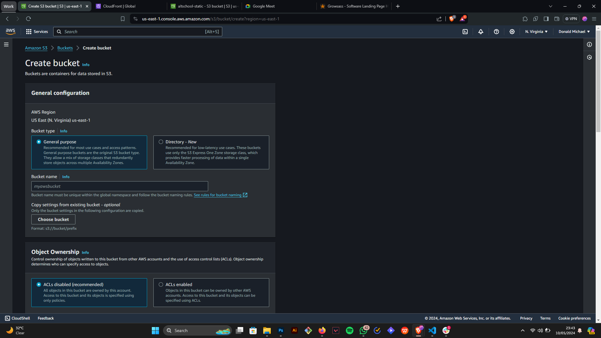

# Deploying a Static Website on AWS CloudFront with S3 Buckets

## Instructions

This guide will walk you through creating a static website, hosting it on a private S3 bucket with public read access, and using CloudFront as a Content Delivery Network (CDN).

**Assignment:**

* Create a static website and deploy it using the steps below.
* Configure the S3 bucket with a public read access policy.
* Use CloudFront for CDN delivery.
* Submit your steps and screenshots to your GitHub repository README by Saturday, May 11th, 10:00 AM. Include screenshots showcasing your AWS account and deployed website.

## Procedure

### Step 1: Prepare Your Static Website Files

Gather your static website files, including HTML, CSS, JavaScript, and images.

### Step 2: Log in to AWS and Create an S3 Bucket

1. Sign in to the AWS Management Console (https://aws.amazon.com/).
2. In the search bar, type "S3" and click on "Amazon S3."

### Step 3: Create a New S3 Bucket

1. Click on "Create bucket."
2. Choose a unique name for your bucket (globally). Use lowercase letters, numbers, and hyphens for the name.
3. Leave all other options with their default settings.
4. Click on "Create bucket" at the bottom of the page.

**Note:** A bucket name must be unique across all AWS accounts.

### Step 4: Upload Static Website Files

1. In the S3 console, navigate to your newly created bucket.
2. Click the "Upload" button.
3. Select the static website files you prepared in Step 1.
4. Click "Upload" to upload the files to the root folder of your S3 bucket.

### Step 5: Access CloudFront

1. In the AWS Management Console, search for "CloudFront" and click on it.

### Step 6: Create a CloudFront Distribution

1. Click on the "Create Distribution" button.

### Step 7: Configure CloudFront Distribution

**Origin:**

1. Under "Origin Domain Name," choose the S3 bucket you created in Step 3.
2. Change "Origin Access" to "Origin access control settings."
3. Click on "Create new OAC." Leave all options with their default settings and click "Create."
   * This step is optional but recommended for security. You can learn more about Origin Access Control in the AWS documentation [link to AWS documentation on OAC].
4. Leave other settings under "Origin" with their default values.

**Web Application Firewall (WAF):**

1. Under "Web Application Firewall," choose any option you'd like

**Settings:**

1. Under "Settings," you can optionally add a default root object (e.g., "index.html"). This specifies the file to load when someone visits your website's root URL.
2. Leave other settings with their default values.

3. Scroll down and click on "Create Distribution."

### Step 8: Copy Bucket Policy and Set Permissions

1. AWS will automatically generate a new policy statement for your S3 bucket due to the Origin Access Control (OAC) configuration.
2. Navigate to your S3 bucket in the AWS Management Console.
3. Click on the "Permissions" tab.
4. Under "Bucket Policy," click on "Edit."
5. Paste the automatically generated policy statement into the edit window.
6. Click on "Save" to apply the policy changes.

**Note:** This policy grants CloudFront permission to access the objects in your S3 bucket. Without this policy, CloudFront wouldn't be able to deliver your website content.

### Step 9: View Your Deployed Website

1. Go back to the CloudFront console.
2. Locate the "Distribution Domain Name" for your newly created distribution. This is the public URL where your website will be accessible.
3. Copy the domain name.
4. Paste the copied domain name into your web browser's address bar and press Enter.

